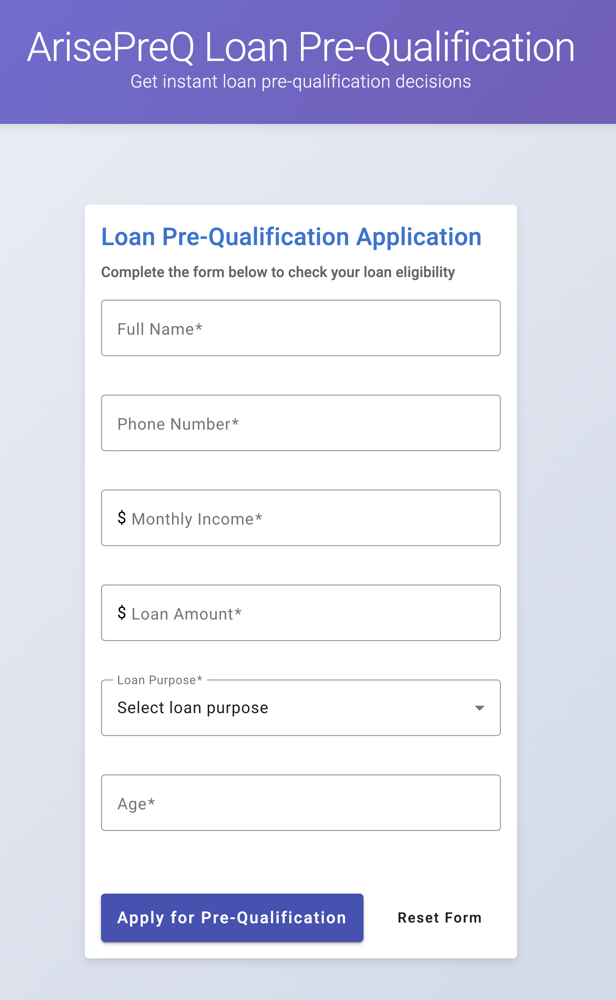
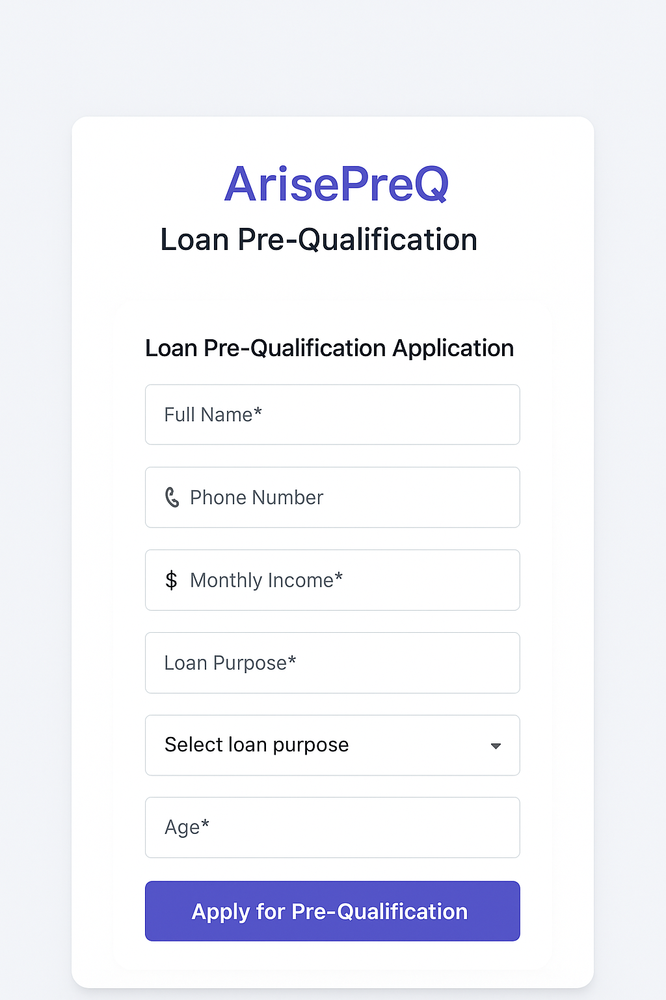
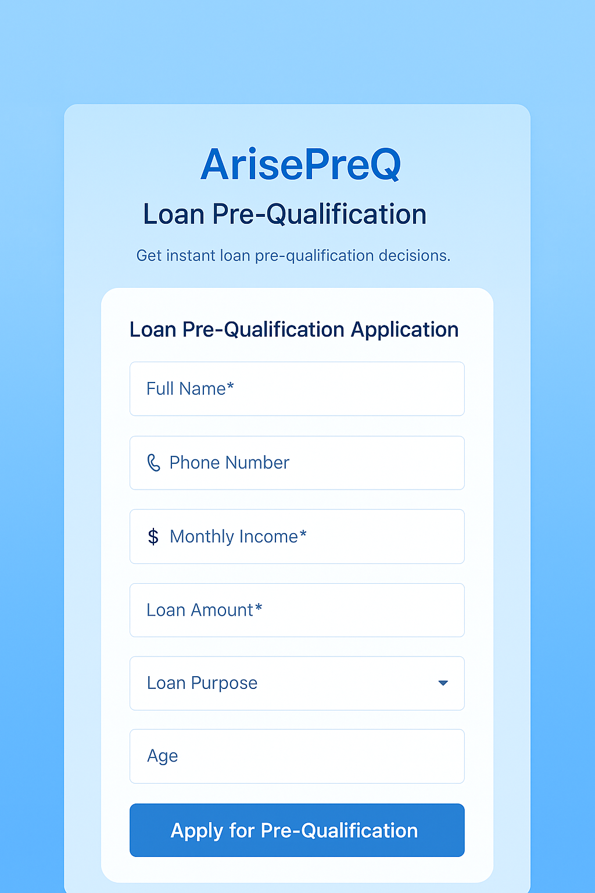

# Mini Project Challenge

## 🏆 ArisePreQ: Loan Pre-Approval Challenge

Welcome to the **Arise Loan Pre-Approval/Pre-Qualification System (ArisePreQ)** challenge. Your task is to design and implement a small-scale system that allows users to submit loan applications and receive instant pre-qualification decisions — **with both frontend and backend** by using the technologies and practices we use in our organization.

You have **19 - 23 July 2025** to complete this challenge, and it will be evaluated based on your ability to deliver a functional software solution that meets the requirements outlined below.

## 🧠 Learning Objectives

- Learn how to **translate business requirements into effective system designs**.
- Understand how to **convert system designs into real, working implementations**.
- Gain **hands-on experience** with **end-to-end software development**.
- Practice **delivering functional software solutions** that address real business needs.
- Become familiar with **tools and technologies** specific to our organization’s tech stack and practices.
- Enable collaboration within a **fusion team**—a multidisciplinary team combining business and technical expertise—to accelerate the delivery of digital products and services.

## 🎯 Learning Outcomes

By the end of this challenge, participants will:

- Gain hands-on experience in bootstrapping projects from the ground up, including initial setup, architecture decisions, and establishing foundational components
- Understand the **big picture** of how to **build and deliver software products independently**.
- Gain **practical experience** in the **entire software development lifecycle**—from ideation to deployment.
- Be able to **connect business needs to technical solutions**, aligning requirements, design, and implementation.
- Experience a **working knowledge** of the **tools and technologies** used in our organization.
- Be prepared to **contribute effectively** to a fusion team, leveraging both business and technical skills.

# Mini Project Challenge Guideline

You are **allowed to use any AI** tool that you like to achieve this Challenge also please share you techniques and tool in [NOTE.md](./NOTE.md#ai-tools-that-i-use)

## Project Structure

```
📁 teamXYZ/
├── backend/        # Backend code (e.g., APIs, server logic)
├── frontend/       # Frontend code (e.g., React/Vue UI)
├── deploy/         # Deployment-related configs (e.g., Docker, Kubernete)
├── e2e/            # End-to-end testing automation (Robot Framework or Playwright)
├── k6/             # Load testing configs (e.g., scripts, test scenarios)
├── scripts/        # Utility or automation scripts (e.g., setup, testing, DB migration)
├── README.md       # Project overview and setup instructions
├── Makefile        # All Common development commands
```

## Kubernestes

## Kubernetes Environment

While we may not have access to a full cloud environment, this challenge provides hands-on experience with Kubernetes - a core component of our tech stack. Let's build something amazing! 🚀

- For this challenge, we'll be using [colima kubernetes](https://github.com/abiosoft/colima?tab=readme-ov-file#kubernetes) as our local Kubernetes environment. You can start it with `colima start --kubernetes --cpu 4 --memory 8 --disk 60`. Colima is lightweight and simple to use. If you encounter any issues with colima, you may alternatively use other local Kubernetes tools such as [minikube](https://minikube.sigs.k8s.io/docs/start), [kind](https://kind.sigs.k8s.io/), or [k3d](https://k3d.io/stable/) etc.

## How we will check your submission

- [ ] We will use colima kubernetes as the environment to check your solution
- [ ] We will verify that all git commits are [signed using GPG](https://dev.to/anuchito/kaar-sign-gpg-kab-git-commit-3i5f) with your personal key (it must be green)
- [ ] we will checkout code on `main` branch only
- [ ] Your application must be deployable to a colima kubernetes cluster
- [ ] We will run `make k8s-deploy` to deploy your application to colima kubernetes
- [ ] Ensure all components (frontend, backend, database or any cached) are properly configured to work in this environment
- [ ] We will run against Fronend NodePort: `30080` and Backend NodePort: `30090`
- [ ] then we will run `make smoke-test`
- [ ] then we will run `make load-test`
- [ ] then we will run `make stress-test`
- [ ] then we will run `make spike-test`
- [ ] then we will run `make load-web-test` you should write a simple load test for a frontend page
- [ ] then we will run `make validate-payload-test`
- [ ] then we will check data in database at NodePort: `30050`
- [ ] then check the code quality
- [ ] We will give bonus point on your learning journey through the [NOTE.md My Learning](./NOTE.md#my-learning) section, where you should document your challenges, insights, and reflections throughout the development process.
- [ ] All timestamps and date-related operations **MUST** use **"Asia/Bangkok"** timezone (UTC+7)

## 📦 Submission Checklist

- All available commands **MUST** be added to the *Makefile* at the root folder
- All git commits **MUST** be [signed using GPG](https://dev.to/anuchito/kaar-sign-gpg-kab-git-commit-3i5f)
- You can have as much git branch as you like but **MUST** merge code into `main` branch before challenge end because we will checkout code on `main` branch only
- Backend:
    - Backend **MUST** have some tests (e.g. unit test, integration test)
    - Test coverage for backend **MUST** exceed 80%
    - All input to the backend **MUST** be [validated](#frontendbackend-validation)
- Frontend:
    - Frontend **MUST** have some tests (e.g. unit test, component test)
    - Test coverage for frontend **MUST** exceed 80%
    - All input in frontend **MUST** be [validated](#frontendbackend-validation) in frontend form
- Database:
    - **MUST** use Database to store the loan application and eligible result (you can use PostgreSQL, MySQL or MongoDB)
    - Database **MUST** be initialized and ready to use when starting the application
    - Database schema/collections should be automatically created on startup
    - Include seed data for testing purposes
    - Connection details should be configurable via environment variables
    - Database **MUST** be properly containerized for local development
- Kubernetes
    - **MUST** use Kubernetes to deploy the application as Production environment (we'll use colima kubernetes as our local Kubernetes cluster)
    - All deployment files **MUST** be organized according to the project structure defined in the guideline
    - Standard port configuration:
      - Frontend **MUST** be accessible via NodePort: `30080`
      - Backend **MUST** be accessible via NodePort: `30090`
      - Database **MUST** be accessible via NodePort: `30050`
      - NodePort **MUST** be explicitly defined in Kubernetes service manifests (e.g. service.yaml) with frontend using port 30080 and backend using port 30090
    - Your application **MUST** be deployable with a single command: `make k8s-deploy`
    - Frontend image: `teamXYZ-frontend`
    - Backend image: `teamXYZ-backend`
    - create a kubernetes service name `frontend-service`
    - create a kubernetes service name `backend-service`
    - create a kubernetes service name `database-service`
    - Kubernetes manifests files **MUST** be organized according to the project structure defined

```
  📁 deploy/
├── frontend-deployment.yaml    # Frontend deployment configuration
├── frontend-service.yaml       # Frontend service configuration
├── backend-deployment.yaml     # Backend deployment configuration
├── backend-service.yaml        # Backend service configuration
├── backend-configmap.yaml      # Backend configuration
├── database-statefulset.yaml   # Database stateful set
├── database-service.yaml       # Database service
├── database-pvc.yaml           # Persistent volume claim
├── namespace.yaml              # Namespace definition
└── secrets.yaml                # Shared secrets
└── ....yaml
```

- K6
    - All scripts in the `k6/` directory **MUST** run successfully without any failures or errors
    - Your application must successfully handle the standard load test without generating errors
    - You **MUST** write a simple load test for a frontend page in file `k6/06-frontend-web.average.test.js` so that when we run `make load-web-test`, it should become pass.

- E2E
    - You **MUST** provide at least one end-to-end test script in the `e2e/` directory

- Scripts
    - All scripts in the `scripts/` directory **MUST** run successfully without any failures or errors
    - Your application must successfully handle the standard load test without generating errors

- Local Development Environment
    - You are free to set up any local development workflow that suits your needs
    - You can use docker-compose.yml file for local development (but we don't check it)
    - Run `make start-local` to start all application components locally
    - This provides a convenient way to develop and test before deploying to Kubernetes

- Submission Format:
  - Commit code into your git teamXYZ repository and **MUST** be [signed using GPG](https://dev.to/anuchito/kaar-sign-gpg-kab-git-commit-3i5f) to verify your identity and authorship
  - Organize your code according to the project structure defined in the guidelines
  - Provide a comprehensive with clear, step-by-step instructions if any in [NOTE.md](./NOTE.md#system-note) for running your application
  - Document all issues and obstacles you encountered during development in [NOTE.md My Learning](./NOTE.md#my-learning)
    - Include a reflection section that covers:
        - Key lessons learned
        - Strengths of your implementation
        - Areas you've identified for future improvement

## Other note
- Database must be initialized and ready to use when starting the application
- Database schema/collections should be automatically created on startup
- Ensure proper error handling  base on your justment including UI bahavior
- Any additional components or configurations needed for your implementation should be documented thoroughly in the [NOTE.md System note](./NOTE.md#system-note) section.
- you can run `make help` to see all available commands
- You may have trouble connecting your frontend and backend in the local Kubernetes cluster. For this challenge, it's fine as long as you can get all parts working together within your local machine's Kubernetes environment.

### Example webpage
The UI design is flexible - feel free to create your own interface that effectively serves the loan application process. Below are some example layouts you might consider, but you're not required to follow these specific designs: [UI examples](#ui-examples)

## 🧪 Loan Eligibility Rules (Backend Logic)

### ✅ Eligibility Criteria

To be eligible, a loan application must meet **all** of the following conditions:

1. **Monthly Income Minimum Threshold**
   - ✅ Eligible if `monthlyIncome >= 10000`
   - ❌ Not Eligible if:
     - `monthlyIncome < 10000`
     - **Error:** `"Monthly income is insufficient"`

2. **Age Requirement**
   - ✅ Eligible if Age must be between **20 and 60** (inclusive).
   - ❌ Not Eligible if:
     - `age < 20` or `age > 60`
     - **Error:** `"Age not in range (must be between 20-60)"`

3. **Loan Purpose**
   - ✅ Eligible if Loan purpose must **not** be `"business"`.
   - ❌ Not Eligible if:
     - `loanPurpose == "business"`
     - **Error:** `"Business loans not supported"`

4. **Loan Amount Cap**
   - ✅ Eligible if `loanAmount <= 12 * monthlyIncome`
   - ❌ Not Eligible if
     - `loanAmount > 12 * monthlyIncome`
     - **Error:** `"Loan amount cannot exceed 12 months of income"`

If **all** of the above conditions are satisfied, the application is:

- ✅ **Eligible under base rules**

Otherwise, the system should return the relevant **error message** from the checks above.

### Frontend/Backend validation

| Field           | Type   | Required | Validation                                              |
|-----------------|--------|----------|---------------------------------------------------------|
| `fullName`      | string | ✅        | 2–255 characters                                        |
| `monthlyIncome` | number | ✅        | 5000 ≤ value ≤ 5,000,000                                |
| `loanAmount`    | number | ✅        | 1000 ≤ value ≤ 5,000,000                                |
| `loanPurpose`   | string | ✅        | must not be empty and in the list of [Loan Purpose List](#loan-purpose-list)                                       |
| `age`           | number | ✅        | more than 0                                           |
| `phoneNumber`   | string | ✅        | valid phone format (e.g., 10 digits) and all number 0-9|
| `email`         | string | ✅        | must be a valid email                                   |

- [note for conflict](#some-conflict)


### API Design Specification

### 1. Apply for a Loan

summary: submit a loan application

- Method: `POST`
- Endpoint: `/api/v1/loans`
- Content-Type: `application/json`
- Valid Request Body:

```json
{
  "fullName": "Somkanit Jitsanook",
  "monthlyIncome": 5000,
  "loanAmount": 10000,
  "loanPurpose": "home",
  "age": 25,
  "phoneNumber": "0851234567",
  "email": "demo@example.com"
}
```

- Success Response:

HTTP Status Code: 200

```json
{
  "applicationId": "3fa85f64-5717-4562-b3fc-2c963f66afa6",
  "eligible": true,
  "reason": "Eligible under base rules",
  "timestamp": "2025-07-19T19:34:56+07:00"
}
```

- Error Response: bad request

HTTP Status Code: 400

```json
{
  "message": "Invalid request body",
  "reason": "missing required fields: fullName, monthlyIncome, loanAmount, loanPurpose, age, phoneNumber, email"
}
```

```json
{
  "message": "Invalid request body",
  "reason": "email must be a valid email"
}
```


- Other Error Response: handle other errors as needed

### 2. Get Loan Status

summary: get the status of a loan application

- Method: `GET`
- Endpoint: `/api/v1/loans/:applicationId`
- Success Response:

```json
{
  "applicationId": "3fa85f64-5717-4562-b3fc-2c963f66afa6",
  "fullName": "Somkanit Jitsanook",
  "monthlyIncome": 5000,
  "loanAmount": 10000,
  "loanPurpose": "home",
  "age": 25,
  "phoneNumber": "0851234567",
  "email": "demo@example.com",
  "eligible": true,
  "reason": "Eligible under base rules",
  "timestamp": "2025-07-19T19:34:56+07:00"
}
```

- Error Response: not found

HTTP Status Code: 404

```json
{
  "message": "Loan application not found",
  "reason": "applicationId not found: 3fa85f64-5717-4562-b3fc-2c963f66afa6"
}
```

- Other Error Response: handle other errors as needed

### 3. Get All Loans
summary: get all loan applications with pagination and filtering (pagination is required feature, filtering is nice to have feature not important)

- Endpoint: `/api/v1/loans`
- Query Parameters:
  - `page=1&limit=10`
  - `eligible=true|false`
  - `purpose=education|business|...`
- Response:

```json
{
  "applications": [...],
  "page": 1,
  "totalPages": 5
}
```

- no data response:

```json
{
  "applications": [],
  "page": 1,
  "totalPages": 0
}
```

- Other Error Response: handle other errors as needed

## Loan Purpose List

- 'education'
- 'home'
- 'car'
- 'business'
- 'personal'


## UI Examples

### Example 1:


### Example 2:


### Example 3:



## Resources:

- Kubernetes Explained in 100 Seconds | https://youtu.be/PziYflu8cB8
- Kubernetes Explained in 6 Minutes | https://youtu.be/TlHvYWVUZyc
- Kubernetes explained in 15 mins | https://youtu.be/VnvRFRk_51k
- Docker vs Kubernetes Comparison in 5 mins | https://youtu.be/9_s3h_GVzZc
- Kubernetes Hands-on in 15 Minutes | https://youtu.be/r2zuL9MW6wc
- Kubernetes Crash Course for Absolute Beginners | https://youtu.be/s_o8dwzRlu4

## Frequently Asked Questions (FAQ)
- you are allow to ask **anything** about this challenge in this channel: DevTrail!: Chat Channel Arise & INFINITAS
- you are allow to ask **for help** about this challenge in this channel: DevTrail!: Chat Channel Arise & INFINITAS

### 🔧 Environment & Tooling

**Q1: Can I use Docker Compose for local dev, or do I have to use Kubernetes locally?**
✅ You can use Docker Compose for development, but your final submission **must be deployable on Colima Kubernetes** via `make k8s-deploy`.

**Q2: What do I do if Colima doesn’t work on my machine?**
✅ You can use **minikube**, **kind**, or **k3d** locally. But we will test your code on **Colima**, so make sure it works there.

**Q3: Can I use any database or do I have to use PostgreSQL?**
✅ You can use **PostgreSQL**, **MySQL**, or **MongoDB**, as long as it is containerized and exposed via NodePort `30050`.

---

### ⚙️ Backend Logic / API

**Q4: Can I allow a monthlyIncome below 10,000 in the frontend?**
✅ Yes. The form validation allows `>= 5,000`, but the backend eligibility logic will reject values below `10,000`.

**Q5: Can I store the eligibility decision in the database?**
✅ Yes — you **must** store the application data, eligibility status, and timestamp.

**Q6: Do I have to use UUIDs for application IDs?**
✅ Yes — application IDs must be in standard UUID format.

**Q7: Does pagination on `/api/v1/loans` require filtering?**
❌ Filtering is optional. ✅ Pagination (`page`, `limit`) is required.

---

### 🖼️ Frontend

**Q8: Do I have to follow the sample UI design exactly?**
❌ No. You're free to design your own UI as long as it meets functional requirements.

**Q9: How should I validate fields like phone numbers and emails?**
✅ Use standard validation:
- Phone: 10-digit numeric only (e.g., `0851234567`)
- Email: must follow email format (e.g., `user@example.com`)
- All fields are required and must follow validation constraints.

---

### 📦 Makefile & Deployment

**Q10: What should `make k8s-deploy` do exactly?**
It should:
- Build frontend/backend images
- Apply Kubernetes manifests from `deploy/`
- Ensure services are exposed on:
  - Frontend: `30080`
  - Backend: `30090`
  - DB: `30050`

**Q11: Do I need to include volume or PVC for the database?**

✅ Yes. Use a `PersistentVolumeClaim` in your database deployment for persistent storage.

---

### 🧪 Testing

**Q12: What tools can I use for e2e testing?**
✅ You can use **Playwright**, **Robot Framework** — place scripts in the `e2e/` folder.

**Q13: What’s the difference between smoke/load/stress/spike tests?**
- **Smoke test**: Basic check that the app runs
- **Load test**: Handles normal traffic (many users)
- **Stress test**: Pushes app beyond its limits
- **Spike test**: Sudden traffic spikes

---

### 📄 Docs, GPG, and Submission

**Q14: How do I GPG-sign commits?**
Follow this guide: [GPG signing](https://dev.to/anuchito/kaar-sign-gpg-kab-git-commit-3i5f)

**Q15: Do I need to write anything in NOTE.md?**
✅ Yes. You must include:
- `#ai-tools-that-i-use`
- `#my-learning` (your experience)
- `#system-note` (any setup/config info)

**Q16: What timezone do I use for timestamps?**
✅ All timestamps must use **Asia/Bangkok** timezone (`UTC+7`).

**Q17: Do we need to mock the email or phone validation?**
❌ No — just validate formats. No need for real email/SMS verification.

**Q18: Can we use external AI or Copilot tools?**
✅ Yes — just document them under `NOTE.md` → `#ai-tools-that-i-use`.

---

### 🧠 Conceptual Clarification

**Q19: Why is monthly income allowed to be >= 5,000 but not eligible until 10,000?**
Validation (>= 5,000) ensures the input isn’t garbage.
Eligibility (>= 10,000) is the business rule.
This separation improves testing and UX clarity.

**Q20: Can I use frameworks like Spring Boot?**
✅ Yes — use any stack or framework that our organization uses in daily basis


### some conflict

🤔 The Conflict Concept Value

Frontend/Backend Validation monthlyIncome >= 5,000
Eligibility Rule monthlyIncome >= 10,000

This means:

A user can submit an application with 5,000 income (passes input validation)

But the system will reject it during eligibility check

✅ What Should We Do?
You should keep them separate because they serve different purposes:

Layer Purpose Threshold
Validation Ensure the value is not garbage >= 5,000 (minimum to prevent nonsense input)
Eligibility Rule Apply business logic on valid input >= 10,000 (as a business requirement)

So the user can submit 5,000 income, but they'll be ineligible and told "Monthly income is insufficient".

This is good design because:

It allows flexibility in UI testing, especially in negative cases.

It separates technical input boundaries from business decisions.
